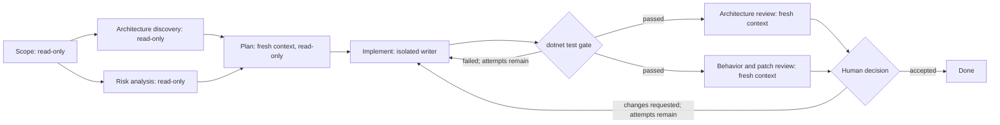

# Graph and quality tooling — research and decision guide

- **Date:** 2026-08-19
- **Type:** research and decision-support guide
- **Decision:** make no harness workflow change in this phase. Learn graph engineering from the C# example, evaluate Graphify before starting a separate C# viewer project, and evaluate existing .NET quality tools on demand before considering harness integration.
- **Progress tracker:** follow the living [graph and quality tooling adoption roadmap](graph-and-quality-adoption-roadmap.md) to see the current step, evidence, and next action.
- **Current follow-up:** see the [2026-09-10 conclusions and pilot report](2026-09-10-graphify-architecture-quality-follow-up.md) for the Graphify harness trial, Archify comparison, and current decisions.

## Source note

The starting point was [LIVE: Uncle Bob on Software Fundamentals in the Age of AI](https://www.youtube.com/watch?v=zcLPGC-tvgk&t=1235s). On 2026-08-19 the YouTube page reported that subtitles/closed captions were unavailable. This guide therefore does not invent quotations or timestamp-level claims from the video. The descriptions of Uncle Bob's current tools below come from his public repositories and prompt files; the proposed C# viewer extends the documented `arch-view` interaction rather than claiming to reproduce anything said in the recording.

## The word “graph” hides three different ideas

These ideas can cooperate, but they solve different problems and should not be treated as interchangeable.

| Graph | Nodes represent | Edges represent | Main question | Likely home |
|---|---|---|---|---|
| Workflow graph | Work steps, deterministic commands, agents, or human decisions | Allowed transitions and artifact flow | “What must happen next, and under what condition?” | Possible future harness workflow |
| Code knowledge graph | Files, types, functions, documents, concepts, and other extracted entities | Calls, imports, inheritance, references, or inferred semantic relationships | “What is related to this code or concept?” | Optional analysis tool |
| Architecture containment/dependency graph | Systems, projects, modules, namespaces, types, and members | “Contains” plus compile-time or runtime dependencies | “What is inside this module, and which direction do dependencies run?” | Separate C# viewer candidate |

LangGraph describes a workflow graph in terms of shared state, nodes that perform work, and edges that choose the next node. Nodes need not be agents: they can be ordinary code or tool calls. Its graphs may branch and loop rather than being only directed acyclic graphs (DAGs). [LangGraph's Graph API documentation](https://langchain-ai.github.io/langgraph/concepts/low_level/) and LangChain's retrospective on [three years of “graph engineering”](https://www.langchain.com/blog/3-years-of-graph-engineering-with-langgraph) use the term in this orchestration sense.

Graphify uses “graph” differently. It parses a repository into entities and relationships that can be queried later; it does not decide the order in which implementation agents should work. Its first-party README calls the result a local code knowledge graph and documents extracted or inferred edges, queries, paths, and a clickable HTML output. [Graphify repository](https://github.com/Graphify-Labs/graphify)

The proposed architecture viewer needs both a containment tree and a dependency graph. The C4 model provides useful zoom levels—software system, container, component, and code—but its abstractions are a communication model, not a C# compiler index. [C4 abstractions](https://c4model.com/abstractions) A C# implementation should use Roslyn to attach the visual model to real solutions, projects, documents, syntax, and symbols. [Roslyn workspace model](https://learn.microsoft.com/en-us/dotnet/csharp/roslyn-sdk/work-with-workspace)

## Graph engineering in plain language

Graph engineering is the design of a repeatable work process as explicit nodes, edges, state, and contracts. It is useful when a single long-running agent loop has become hard to inspect or control.

A sound workflow graph has six parts:

1. **State:** the small set of facts that must survive between steps, such as the task identifier, selected repository, current commit, attempt count, and artifact paths.
2. **Nodes:** bounded units of work. A node can run a command, ask an agent to plan, perform a review, or wait for human approval.
3. **Edges:** transitions such as “tests passed,” “tests failed,” “risk is high,” or “human approved.” An edge should be chosen from explicit output, not an agent's vague confidence.
4. **Artifacts:** durable handoffs such as a scope document, patch, test report, coverage file, or review report. Artifacts make a node's output inspectable and allow the next node to start with fresh context.
5. **Gates:** checks against reality. Compilation, tests, architecture tests, schema validation, and a human decision are stronger gates than another model saying that the work looks correct.
6. **Termination rules:** retry limits, time/cost budgets, and an explicit blocked state. A loop without a stopping rule is an incident waiting to happen.

This is consistent with Anthropic's distinction between fixed workflows and agents that dynamically direct their own process. Their guidance is to start with the simplest pattern that works, then add chaining, routing, parallelization, orchestrator-worker, or evaluator-optimizer structure only when it buys measurable reliability. [Building effective agents](https://www.anthropic.com/engineering/building-effective-agents) OpenAI's Agents SDK makes the same practical distinction between orchestration in ordinary code and orchestration delegated to an LLM. [Orchestrating multiple agents](https://openai.github.io/openai-agents-python/multi_agent/)

### Worked example: a small C# order-cancellation change

Suppose a service needs `POST /orders/{id}/cancel`. A pending order may be cancelled with a reason; a shipped order must be rejected. This is only a teaching example—the target project's actual domain rules remain the source of truth.



| Node | Capability | Input | Output artifact | Exit/gate contract |
|---|---|---|---|---|
| Scope | Read repository and issue; no writes | User request and current commit | `scope.md` with affected projects, invariants, acceptance examples, and unknowns | Human or schema confirms that success is testable |
| Architecture discovery | Read-only, may run in parallel | `scope.md` and solution structure | `architecture.md` with affected projects, dependency direction, existing tests, and implementation seams | Facts cite source paths; uncertainty stays explicit |
| Risk analysis | Read-only, may run in parallel | `scope.md`, domain rules, and relevant history | `risks.md` covering authorization, state transitions, concurrency, persistence, and denied paths | Every material risk has a test or an explicit human decision |
| Plan | Read-only, new context | `scope.md`, `architecture.md`, and `risks.md` | `plan.md` naming seams, tests, and expected files | Plan cites each acceptance example and unresolved choice |
| Implement | Write only in the task worktree | `scope.md`, `plan.md`, current source | Patch plus `implementation.json` containing the base commit and changed paths | Writer cannot declare itself complete |
| Build/test | Deterministic command runner | Worktree | compiler output, TRX, and any project-owned architecture-test results | Real `dotnet test` exit code; no model judgment |
| Independent reviews | Two read-only, fresh contexts after the test gate | Scope, architecture/risk artifacts, diff, and gate evidence | Separate `architecture-review.md` and `patch-review.md` findings linked to evidence | Reviewers do not edit or approve their own work; human receives disagreements intact |
| Decide | Human | All compact artifacts | Accepted, changes requested, or blocked | Explicit decision and bounded retry count |

The shape is deliberate: **scope → parallel analysis → plan → implementation → real test gate → independent reviews → human decision**. Architecture discovery and risk analysis can run in parallel because both are read-only and produce compatible artifacts. The plan joins them before any writer starts; the two reviews fan out only after `dotnet test` has supplied evidence about the actual patch.

Fresh context matters at the plan and review nodes. The implementer has accumulated assumptions and is naturally inclined to defend its own patch. A reviewer started with only the requirement, diff, and actual gate evidence is less likely to inherit that narrative. The artifacts preserve necessary facts without preserving every speculative conversation turn.

The graph also makes authority visible. Read-only nodes cannot edit. Only the implementation node writes code, and it does so in an isolated task worktree. Command nodes return evidence rather than prose. A human controls the final material decision.

For this small endpoint, however, a single agent loop is often cheaper. If the change affects one project and a few files, the acceptance criteria are clear, and the normal build/test gate is fast, creating several node handoffs adds latency and failure surface without much independent value. Use the graph when there are costly gates, multiple independent reviews, meaningful capability boundaries, resumability requirements, or parallel work that produces compatible artifacts. Otherwise use one well-instructed loop and the repository's normal verification command.

### When not to use a workflow graph

Stay with one loop when one worker can hold the relevant context, the next step is always obvious, feedback is cheap, and there is no security or independence benefit from another role. A graph is also a poor fit when the proposed handoff cannot be expressed more precisely than “read everything the previous agent saw,” or when several writing nodes would continually negotiate the same design seam. First improve the task, tests, module boundaries, or artifact contract; orchestration cannot repair an undefined objective.

### Failure modes to design for

| Failure | Why it happens | Required defense |
|---|---|---|
| Orchestration becomes more complex than the change | Every task is forced through the largest graph | Select a small, standard, or high-risk profile from explicit criteria |
| Correlated model error | Several nodes use the same model and the same false assumption | Add deterministic evidence, diverse review perspectives where justified, and human approval for material choices |
| Lossy artifact handoff | A summary omits a constraint that was only in conversation | Version a small artifact schema; include source references, unknowns, and acceptance examples |
| Stale resume | Cached artifacts belong to an older commit or dependency state | Record input hashes/base commit and invalidate downstream nodes when inputs change |
| Parallel writers conflict | Workers make incompatible decisions or touch the same seam | Partition ownership up front; prefer parallel read-only analysis; serialize overlapping writes |
| Capability leakage | A reviewer or extractor gains write, network, or secret access it does not need | Deny by default and assign permissions per node |
| “Agent approved” becomes a fake gate | A model grades its own narrative instead of the system | Gate on exit codes and machine-readable outputs; keep human decisions explicit |
| Green tests, wrong behavior | Tests encode an incomplete or mistaken requirement | Carry acceptance examples from scope to review and test denied/error paths |
| Graph extraction invents dependencies | Parsers cannot fully resolve dynamic behavior or generated code | Preserve edge provenance and confidence; let source/compiler evidence win |
| Sensitive material enters artifacts | A graph or report indexes ignored files, secrets, or customer data | Use allowlists/ignore rules, local-only defaults, artifact review, and no cloud backend during evaluation |
| Cost and latency explode | Loops have no budget or expensive checks run on every edit | Bound retries; separate fast verification from opt-in hardening |
| Architecture view drifts | A hand-maintained diagram stops matching source | Regenerate facts from the current commit; keep only intentional module overlays hand-authored |

### `geng`: useful study material, not a harness dependency

[`geng.py`](https://github.com/AdityaIndoori/graph-engineering) is a small, single-file, MIT-licensed Python 3.11 prototype runner that expresses a DAG in TOML. Its README models a node as a subprocess, an edge as a file artifact, and success as an exit-code contract; it also describes dependency scheduling, concurrency, gates, resume behavior, per-node capabilities, and optional worktree isolation.

That makes it valuable as readable prototype material. It is not evidence that the harness needs another runtime. A DAG alone also cannot express every evaluator loop without an outer controller, and adopting a young orchestration dependency would add lifecycle, security, and compatibility work. The recommendation is to study its artifact and capability ideas, then prototype only one real harness workflow behind a disposable `prototype/*` branch if the ordinary workflow is demonstrably insufficient. Do not install or vendor `geng` now.

## Graphify: relevant, but not “graph engineering”

The likely tool behind the heard name is [Graphify Labs' `graphify`](https://github.com/Graphify-Labs/graphify). The name is easy to collide with: its own installation section says the official Python package is `graphifyy` with two `y` characters, while the installed command is `graphify`, and warns that other similarly named PyPI packages are unaffiliated. That identity must be verified before any future install.

Graphify's documented code path uses local tree-sitter parsing and emits a graph whose edges are marked `EXTRACTED`, `INFERRED`, or `AMBIGUOUS`. Its language list includes C#. A normal run produces `graph.html`, `GRAPH_REPORT.md`, and `graph.json`; the HTML supports clicking, filtering, and search, while CLI `query`, `path`, and `explain` commands query the JSON and report source locations. The graph can also be exposed through a local stdio MCP server with structured node, neighbor, path, and query operations. [Graphify README: outputs and direct graph access](https://github.com/Graphify-Labs/graphify#using-the-graph-directly)

This could help an agent discover hubs, cross-file links, or likely impact without reading an entire repository. It is not yet the requested architecture browser: tree-sitter supplies syntax rather than the complete C# compilation model, inferred and ambiguous edges must be treated as hypotheses, and the documented generic graph view does not establish a recursive solution → project → module → type → member drill-down contract. Graphify's [architecture document](https://github.com/Graphify-Labs/graphify/blob/main/ARCHITECTURE.md) is useful for understanding its extraction pipeline, but an evaluation must measure C# accuracy rather than accepting the product description.

### Safe, non-installing evaluation

No Graphify command was executed for this research. The first evaluation phase should remain source and documentation review only:

1. Record an exact release tag or commit. Review its `README.md`, `ARCHITECTURE.md`, `SECURITY.md`, `pyproject.toml`, lockfile, install code, skill templates, and hook code at that revision. Confirm licenses—its repository currently exposes Apache-2.0 and MIT license files—and inspect transitive packages before considering execution. [Graphify repository files](https://github.com/Graphify-Labs/graphify)
2. Enumerate writes and authority from the pinned installer source before running it. Treat skill files, agent instructions, Codex configuration, Git hooks, and merge drivers as prohibited surfaces during the first experiment unless the reviewed revision proves they are untouched. [Graphify installation entry point](https://github.com/Graphify-Labs/graphify#install)
3. Confirm data boundaries. The README says code-only tree-sitter extraction is local, while document/media semantic processing can call a configured model backend. An eventual experiment must use code-only mode on a synthetic repository containing no secrets and must verify actual network and filesystem behavior rather than relying only on that statement. [Graphify privacy description and command reference](https://github.com/Graphify-Labs/graphify#privacy--security)
4. Review these vendor-documented commands as text only; **do not run them in this phase**:

   ```text
   uv tool install graphifyy
   graphify install --project --platform codex
   graphify extract ./fixture --code-only
   ```

   The first installs software, the second modifies project agent configuration, and the third performs extraction. Listing them makes the future test reproducible; it does not approve execution.
5. If source review passes, open a separately approved `prototype/*` experiment from the default branch. Pin the reviewed revision, use a disposable C# fixture and isolated environment, deny outbound network, take a before/after filesystem inventory, skip all hooks and persistent agent instructions, and inspect every generated artifact before retaining it.
6. Score the fixture on symbol/call/import/inheritance precision and recall; extracted/inferred/ambiguous provenance; generated-code and partial-class handling; stable output from the same commit; incremental update correctness; runtime and artifact size; secrets/ignore behavior; whether HTML nodes lead to useful source evidence rather than only metadata; and whether CLI/MCP queries return bounded, inspectable subgraphs.
7. Only after the fixture passes, run the same pinned, code-only executable against a read-only copy of one representative repository. Explicitly approve and secret-scan that copy first, keep outbound network denied, skip all installers and hooks, permit writes only in the disposable output directory, and compare the filesystem before and after. Measure whether the graph reduces source reads or review errors on a few real maintenance questions. Do not consider harness integration until both the controlled fixture and representative-repository trial pass.

Adoption requires evidence that the value is greater than maintaining the graph and that uninstalling restores the exact prior state. Until then, Graphify remains an optional evaluation candidate, not part of harness setup.

## The architecture viewer

### Uncle Bob's `arch-view`: the remembered precedent

[`unclebob/arch-view`](https://github.com/unclebob/arch-view) is almost exactly the remembered interaction, but it is a Clojure namespace-dependency browser rather than UML, C4 tooling, or a general architecture model. It scans configured source paths, reads each file's `ns` form, extracts project-local `:require` relationships, records source paths, and builds a hierarchical namespace graph. [arch-view dependency discovery](https://github.com/unclebob/arch-view#dependency-discovery)

The viewer arranges high-level namespaces above leaf source namespaces. It detects cycles before computing a topological layout, keeps the offending relationships visible in red, and shows incoming and outgoing dependency indicators with hoverable paths. Clicking a non-leaf namespace makes it the new root; clicking a leaf opens its source. `Back` restores the previous namespace path and scroll position, while `Reanalyze` rescans and redraws the project. [arch-view layout, legend, and navigation](https://github.com/unclebob/arch-view#layer-rationale)

That behavior is the essence worth carrying forward: hierarchical drill-down, dependency direction at the current level, visible cycles, source navigation, and refresh. Its limits are equally important. Clojure namespaces do not directly provide the C# solution → project → namespace → type → member hierarchy, and `:require` relationships are much narrower than compiler-resolved symbol references. The future viewer therefore should copy the concepts, not assume that `arch-view` is a ready-made C# engine.

### What a C# successor should do

The desired interaction combines C4-like zoom with compiler-backed navigation:

1. Open a solution-level map showing applications, libraries, tests, and external dependencies.
2. Click a project or logical module to replace the current frame with its children.
3. At every level, show only dependencies crossing the visible children's boundaries; expand an edge to see the underlying symbol references that justify it.
4. Continue through namespace/type/member levels.
5. Select a leaf to open the exact source span, with incoming and outgoing references available on demand.
6. Preserve breadcrumbs, filters, back/forward navigation, cycle highlighting, and a stable URL or selection identifier so a human and an agent can discuss the same view.

This is a **containment graph plus dependency projections**, not one enormous UML diagram. Drawing every member and call at once creates an unreadable hairball. Each screen should aggregate lower-level edges for the current module, then reveal evidence as the user drills down. C4's hierarchy is a helpful communication vocabulary, while Uncle Bob's Dependency Rule supplies the architectural question: source dependencies should point inward toward higher-level policy. [The Clean Architecture](https://blog.cleancoder.com/uncle-bob/2012/08/13/the-clean-architecture.html) A useful top-level view should also make the system's use cases visible instead of leading with frameworks, following the idea of [Screaming Architecture](https://blog.cleancoder.com/uncle-bob/2011/09/30/Screaming-Architecture.html).

Roslyn is the appropriate authority for a C# version. Its workspace API represents solutions, projects, and documents, while compilations and semantic models bind syntax to symbols and expose reference meaning. [Roslyn workspace](https://learn.microsoft.com/en-us/dotnet/csharp/roslyn-sdk/work-with-workspace) [Roslyn compiler API model](https://learn.microsoft.com/en-us/dotnet/csharp/roslyn-sdk/compiler-api-model) This is the distinction between “the text contains a call-looking expression” and “the compiler resolved this invocation to this method.” Dynamic dispatch, reflection, dependency injection configuration, generated source, and runtime messages will still require honest `unknown`, `possible`, or separate runtime-evidence edges.

### Graphify versus a dedicated Roslyn viewer

| Dimension | Graphify | Future Roslyn viewer |
|---|---|---|
| Primary purpose | Broad local knowledge graph for code and optionally documents/media | C# architecture comprehension from solution to source |
| C# authority | Tree-sitter syntax plus Graphify resolution/inference | Roslyn solution, compilation, semantic model, and symbols |
| Node model | Cross-language files, code entities, concepts, and documents | Explicit containment: solution, project, logical module, namespace, type, member, source span |
| Edge model | Extracted or inferred calls/imports/references and semantic links | Compiler-resolved project/reference/call/inheritance edges with evidence; uncertain runtime edges kept separate |
| Interaction | Generic clickable/searchable graph and query/path commands | Recursive drill-down, breadcrumbs, boundary aggregation, edge evidence, and source pane |
| Architecture rules | Useful input to human/agent analysis | Can project allowed dependency rules and violations onto the same exact C# graph |
| Best harness relationship | Optional external analyzer after evidence-based evaluation | Separate read-only product invoked by the harness on request |

Graphify may prove useful for broad discovery even if the viewer is built. It should not become the viewer's C# source of truth merely to avoid building a Roslyn indexer.

### License caution

Public source is not automatically permission to copy it. The reviewed [`arch-view` repository root](https://github.com/unclebob/arch-view) does not show a license file, [`crap4clj`](https://github.com/unclebob/crap4clj#license) explicitly says “All rights reserved,” and no clear reusable license was identified for `crap4java`. Treat those implementations as behavioral research only unless the copyright holder grants permission or a qualified license review finds a reusable grant. Reimplement ideas from documented behavior; do not port source line by line.

The architecture viewer should use dependencies with clear compatible licenses and carry its own explicit license. If C4 terminology or example material is reproduced rather than merely linked, follow the C4 site's stated [Creative Commons attribution terms](https://c4model.com/about/licensing). This is a practical engineering precaution, not legal advice.

## CRAP: a metric, not an AI reviewer

CRAP means **Change Risk Anti-Patterns**. It combines a method's cyclomatic complexity with its test coverage:

```text
CRAP(m) = complexity(m)^2 × (1 - coverage(m))^3 + complexity(m)
```

Here `coverage` is a fraction from 0 to 1. Alberto Savoia's history credits the metric to Savoia and Bob Evans in 2007, describes the original coverage input as basis-path coverage, and presents the equivalent percentage formula. It does not attribute the metric's origin to Uncle Bob. [Google Testing Blog: This Code is CRAP](https://testing.googleblog.com/2011/02/this-code-is-crap.html)

The curve penalizes complexity most when tests do not exercise the method. A complexity-2 method scores 2 at full coverage and 6 at zero coverage. A complexity-10 method scores 22.5 at 50% coverage and 110 at zero coverage. This makes CRAP a useful queue: investigate methods that are both branchy and poorly covered before changing them.

It is not proof that code is good, tests are meaningful, or architecture is sound. The metric's co-creator explicitly notes that high coverage can come from poor tests, that some complexity is justified, and that the formula omits design measures such as cohesion and coupling. [CRAP limitations](https://testing.googleblog.com/2011/02/this-code-is-crap.html)

Thresholds are policy, not mathematics. The original article used greater than 30; Uncle Bob's current `crap4java` README documents an exit threshold greater than 8; SwarmForge's cleaner prompt asks for CRAP no greater than 6. Microsoft's .NET skills use still other bands and defaults. [crap4java threshold](https://github.com/unclebob/crap4java#exit-codes) [SwarmForge cleaner role](https://raw.githubusercontent.com/unclebob/swarm-forge/six-pack/swarmforge/roles/cleaner.prompt) A team should baseline its repository, report the worst methods and changes over time, and choose a threshold deliberately rather than presenting one number as universal.

Uncle Bob has public CRAP analyzers or skills for [Go](https://github.com/unclebob/crap4go), [Clojure](https://github.com/unclebob/crap4clj), and [Java](https://github.com/unclebob/crap4java). They are useful behavioral references, subject to the license caution above. There is no reason to start a separate C# CRAP product now: Microsoft's official [`dotnet/skills`](https://github.com/dotnet/skills) already contains a project-wide [`coverage-analysis` skill](https://raw.githubusercontent.com/dotnet/skills/main/plugins/dotnet-test/skills/coverage-analysis/SKILL.md) and a targeted [`crap-score` skill](https://raw.githubusercontent.com/dotnet/skills/main/plugins/dotnet-test/skills/crap-score/SKILL.md). Both describe computing CRAP from actual .NET coverage artifacts rather than asking a model to guess coverage.

The two Microsoft skills serve different questions. `coverage-analysis` ranks risk hotspots across a project and, at the reviewed revision, defaults its CRAP flag to 30 alongside configurable line and branch coverage thresholds. `crap-score` is for a named method, class, or file; it labels scores below 5 low, 5–15 moderate, 15–30 high, and above 30 critical, and calculates how much coverage would be needed to get below a target of 15. Both require fresh Cobertura evidence and say to stop rather than publish a CRAP score from assumed coverage. These are workflow defaults, not a new definition of the metric, and must be pinned and reviewed before harness adoption. [Project-wide defaults](https://raw.githubusercontent.com/dotnet/skills/main/plugins/dotnet-test/skills/coverage-analysis/SKILL.md) [Targeted bands and real-coverage requirement](https://raw.githubusercontent.com/dotnet/skills/main/plugins/dotnet-test/skills/crap-score/SKILL.md)

This phase should not add CRAP to the harness. Evaluate the Microsoft skills on a real C# project first. If that evidence later justifies a small on-demand harness workflow, it should:

- run the target project's real tests and produce Cobertura coverage;
- compute complexity and map coverage to methods with explicit handling for missing or stale data;
- report the worst changed methods and the baseline delta before enforcing a global ceiling;
- never substitute estimated coverage, and never let CRAP replace tests, architecture checks, or review;
- pin and review any adopted skill version under the harness's normal supply-chain process.

## Architect and hardender: roles, not magic binaries

Uncle Bob's [SwarmForge](https://github.com/unclebob/swarm-forge) coordinates multiple agent roles. In its `six-pack` branch, the [architect prompt](https://raw.githubusercontent.com/unclebob/swarm-forge/six-pack/swarmforge/roles/architect.prompt) reviews module boundaries, dependency direction, cycles, framework/data-shape leakage, and accidental public APIs, and asks for automated dependency or forbidden-import checks where appropriate. The “architecture enforcer” is therefore best understood as executable rules in the target repository plus a role that inspects and improves them—not a universal standalone analyzer.

For C#, put those rules in project-owned architecture tests so they version with the architecture. [ArchUnitNET](https://github.com/TNG/ArchUnitNET) can express .NET architecture rules, but ordinary tests over project references or Roslyn symbols may be enough for a small system. The harness's job is to discover and run the project's architecture gate; it should not own every project's layer names or dependency policy.

The repository spells the other role **hardender**. Its [hardender prompt](https://raw.githubusercontent.com/unclebob/swarm-forge/six-pack/swarmforge/roles/hardender.prompt) follows architectural review with mutation and quality hardening; the neighboring cleaner role runs coverage, CRAP, duplication, and mutation-site checks. This is a workflow profile, not one “code hardener” executable.

Practical C# equivalents are:

| Intent | C# evidence/tool | Harness treatment |
|---|---|---|
| Enforce dependency direction and forbid cycles | Project architecture tests, optionally [ArchUnitNET](https://github.com/TNG/ArchUnitNET) | Required only when the project declares the gate |
| Detect weak tests | [Stryker.NET](https://github.com/stryker-mutator/stryker-net) mutation testing; Microsoft Learn describes mutation testing and Stryker's .NET flow. [Mutation testing in .NET](https://learn.microsoft.com/en-us/dotnet/core/testing/mutation-testing) | Opt-in hardening because it is slower than normal tests |
| Prioritize complex under-tested methods | Microsoft's .NET CRAP skills using real coverage | Report changed methods first; configure thresholds |
| Detect duplication | A reviewed C#-capable detector such as [jscpd](https://jscpd.dev/) or a project-native analyzer | Advisory first; exclusions must be project-owned |
| Validate end-to-end behavior | Project acceptance tests; Uncle Bob's repository describes an [Acceptance Pipeline Specification](https://github.com/unclebob/Acceptance-Pipeline-Specification) | Project-owned deterministic gate |

The fast path should remain compile, unit/integration tests, and existing verification. A separately requested hardening profile can add mutation, CRAP, duplication, and deeper architectural review. Running all of those after every tiny edit would waste time and encourage bypasses.

## Disposition

| Item | Decision | Home | Next evidence required |
|---|---|---|---|
| Graph-engineering concepts | Teaching and evaluation only; no adoption in this phase | Development guide; possible future harness workflow | One separately approved C# workflow comparison where explicit artifacts/gates might outperform one loop |
| `geng` | Study/prototype only; do not install or vendor | Possible disposable prototype | Reproduce a real harness need and compare complexity with existing orchestration |
| Graphify | Safe source review, then separately approved isolated evaluation; no install now | Optional tool used on request | C# fixture accuracy, privacy/write audit, stability, and demonstrated context savings |
| C# architecture viewer | Own-project candidate after the Graphify evaluation | Future standalone local read-only tool; harness may later invoke CLI/MCP | Show that Graphify cannot provide the deliberate C# hierarchy, then approve the handoff brief and MVP fixture |
| C# CRAP | Evaluate Microsoft's existing .NET skills on demand; do not integrate or build a separate product yet | Target C# project; possible future harness quality profile | Baseline a real C# repository and choose policy |
| Architecture enforcer | Express as project-local executable architecture tests | Target project, invoked by harness | Project declares boundaries and allowed directions |
| Hardender/hardening | Treat as an on-demand workflow concept; no harness change in this phase | Project tools; possible future harness profile | Runtime budget and evidence that findings change decisions |
| Video-only claims | Keep as unresolved leads | Research notes | Captions, transcript, or a directly inspectable first-party implementation |

## Separate-project handoff: C# architecture viewer

Use this brief to start a new conversation and repository.

**Working goal:** after the Graphify evaluation justifies a custom build, create a local, read-only C# architecture browser that opens a `.sln`, displays nested containment from solution to source, projects dependencies at the current level, and lets both a human and an agent navigate to the evidence behind every edge.

Treat the future viewer as a separate deep module. It should own indexing, graph construction, layout, source navigation, and incremental refresh behind one narrow read-only CLI/MCP interface. The harness should know how to ask for a bounded view, not how the viewer builds or stores its graph.

**MVP scope:**

1. A .NET indexer loads a solution with Roslyn `MSBuildWorkspace` and records solution, project, document, namespace, named-type, and member nodes.
2. Every node has a stable identifier, kind, display name, parent, source location when available, and current-commit/index metadata.
3. Dependency records cover project references, inheritance/interface implementation, member/type references, and invocations resolved by Roslyn. Each edge stores source spans as evidence and separates unresolved or possible runtime links.
4. A local UI has a containment pane, an aggregated dependency view, breadcrumbs, filters, edge-evidence expansion, and a read-only source pane. Clicking a node replaces the current module with its children; clicking an edge lists the lower-level references that produced it.
5. A read-only CLI or local stdio MCP surface exposes `overview`, `children`, `dependencies`, `source`, and later `violations`, so the harness can ask for a small subgraph instead of ingesting the whole index.

**Non-goals for MVP:** editing code, cloud upload, language-agnostic parsing, automatic architecture judgment, runtime tracing, UML completeness, mutation testing, or installing persistent agent hooks.

**Security and correctness constraints:** bind any web server to loopback by default; contain all paths inside the explicitly opened repository; do not follow unexpected links outside it; respect configured generated/ignored paths; never read secrets merely because they exist in the tree; escape source text in the browser; write only to an explicit cache/output directory; attach commit/input hashes to the index; and make unknown or ambiguous relationships visible rather than fabricating certainty.

**First fixture and acceptance test:** a tiny multi-project order system with Domain, Application, Infrastructure, Web, and ArchitectureTests projects. Include one permitted inward dependency, one forbidden Domain → Infrastructure dependency, one cycle, an interface implementation, an overloaded call, a partial class, generated code, and a dependency-injection registration. The MVP passes when the user can drill from solution to the exact call site, see aggregated edges change at each zoom level, inspect why each edge exists, detect the deliberate cycle/violation, and obtain the same bounded subgraph through the CLI/MCP API.

**Milestones:** (1) schema plus verified Roslyn fixture index; (2) terminal/JSON queries; (3) interactive containment and source navigation; (4) dependency aggregation and evidence; (5) project-owned rule overlay; (6) optional harness adapter. Keep the extraction core independent of the UI so correctness can be tested without a browser.

**Reuse decision:** evaluate Graphify as a separate broad discovery aid, but do not make its inferred graph the C# authority. Reuse only dependencies and source whose licenses have been reviewed; independently implement the viewer behavior.
