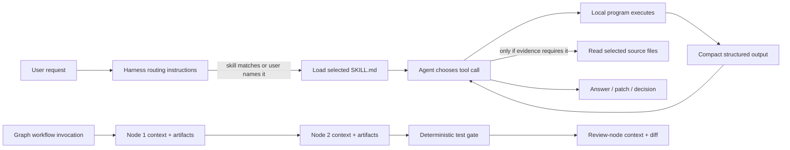

# Graphify, architecture, and quality-tooling follow-up

> Historical research and pilot record. Later decisions in the [living checklist](graph-and-quality-adoption-roadmap.md) supersede the initial integration restrictions below: Graphify is adopted with all capabilities, the harness will have five selectable modules, and Westcoast Cars is selected for C# evaluation. See the [modularity implementation plan](harness-modularity-plan.md).

- **Date:** 2026-09-10
- **Type:** research and decision guide
- **Scope:** clarify the user's current mental model, identify the tool called “Archify,” run a bounded Graphify pilot, and propose an evidence-first adoption path
- **Change policy:** no permanent tool installation and no harness workflow change; Graphify was run from a pinned temporary environment against a committed repository snapshot

## Executive answer

The user's Graphify understanding is mostly correct: Graphify builds a reusable map of code entities and relationships, and an agent can query a bounded part of that map instead of repeatedly opening many files. The important qualification is that reduced token use is a hypothesis to measure, not an automatic outcome. A poor or incomplete query can cause extra graph queries and source reads, making the session more expensive.

The likely “Archify” is [`tt-a1i/archify`](https://github.com/tt-a1i/archify). It is a popular agent skill plus deterministic Node.js renderer. The agent determines the architecture and writes typed JSON; Archify validates and renders that JSON. It does **not** independently extract a complete dependency graph from source. It therefore complements Graphify rather than replacing it.

Roslyn is different again. It is Microsoft's C#/Visual Basic compiler-analysis API, not a viewer or an agent skill. Roslyn can power a highly accurate C# indexer or architecture viewer, but it saves no model tokens until somebody builds a compact query or visualization layer on top of it.

The recommended direction is:

1. Keep `geng` rejected.
2. Adopt Graphify for a controlled user-enabled integration trial, with agent-controlled queries only inside an opted-in session.
3. Adopt `tt-a1i/archify` for a controlled, explicitly user-invoked diagram-skill trial.
4. First try feeding Graphify evidence into Archify; do not build a C# viewer yet.
5. Keep graph engineering as an optional user-invoked workflow without loops at first.
6. Trial Microsoft's CRAP workflows from existing Cobertura evidence before installing them permanently.
7. Keep ArchUnitNET, mutation testing, duplication detection, and acceptance checks project-owned and conditional.

## 1. Graphify: what the user got right

### Mental-model verdict

**Mostly correct.** Graphify maps files, declarations, imports, calls, inheritance, and other relationships into a persisted code knowledge graph. The reviewed Graphify documentation says its code pass uses local tree-sitter parsing, supports C#, resolves cross-file relationships, and produces:

- `graph.html`, for human clicking, filtering, and searching;
- `GRAPH_REPORT.md`, for highlights;
- `graph.json`, for repeatable CLI and MCP queries.

The same documentation exposes `query`, `path`, and `explain` commands plus an MCP server with structured graph operations. [Graphify README: outputs and direct access](https://github.com/Graphify-Labs/graphify/blob/v8/README.md#using-the-graph-directly)

The model should still open source when it needs implementation detail or must verify a graph edge. The graph is an index and navigation aid, not a replacement for source, tests, compilation, or review.

### Does Graphify need an LLM to build the graph?

For the normal **code-only pass, no**. The official README says code is parsed locally and deterministically with tree-sitter, without an LLM or data leaving the machine. Documents, PDFs, images, video, and audio can use a configured model for a semantic pass. [Graphify README: local-first extraction](https://github.com/Graphify-Labs/graphify/blob/v8/README.md#what-it-does)

This means the responsibilities are separate:

| Work | Performed by | Model tokens |
|---|---|---:|
| Parse code and build AST-derived graph | Graphify program | None for the documented code-only path |
| Cluster and render `graph.html`/`graph.json` | Graphify program | None for the documented code-only path |
| Query nodes, neighbors, or paths | Graphify CLI/MCP | No model tokens inside Graphify; returned text consumes agent context |
| Decide which query to ask | Agent or human | Agent tokens if the agent decides |
| Read and reason about the returned subgraph/source | Agent | Yes |
| Semantically process non-code media | Configured model backend | Yes |

Graphify is a **program with an optional skill and MCP adapter**. The program can build and query code graphs from the terminal without an agent. The skill teaches an agent when and how to invoke the program. MCP gives an agent a structured interface to an existing graph.

### Will it save tokens?

It can, but that must be demonstrated on this harness and on a representative C# repository.

Graphify's own benchmark reports that, on six questions against ERPNext, a fixed coding agent's key-fact coverage increased from 70.8% with grep/read to 82.0% with a Graphify tool, at about 140,000 tokens per query. It also compares this with stuffing the whole repository into context. This is useful first-party evidence, but it is a self-published experiment with only six code questions—not a guarantee for this harness. [Graphify benchmarks](https://github.com/Graphify-Labs/graphify/blob/v8/BENCHMARKS.md#results-code-intelligence)

Graphify's own issue tracker also records the opposite failure mode: weak seed selection caused several approximately 2,000-token query responses, producing 6,000–8,000 tokens of low-signal context and making Graphify slower and more expensive than ordinary grep. The issue also records a former 12,000–25,000-token cost from always reading the large report first. [Graphify issue #897](https://github.com/Graphify-Labs/graphify/issues/897)

Therefore the honest claim is:

> Graphify can replace broad exploratory file reads with smaller graph queries, but only accurate retrieval and disciplined query budgets create a net token saving.

### User-controlled or agent-controlled?

Use **split control**:

| Decision | Owner | Reason |
|---|---|---|
| Whether a project uses Graphify | User/project | It adds generated artifacts, dependencies, ignore policy, and maintenance work |
| What Graphify may scan | User/project config | Scope and exclusions are security and relevance decisions |
| When the graph is built or refreshed | User initially | Prevents surprising hooks, background writes, and stale assumptions during the pilot |
| Which graph query answers a task | Agent | Query selection is part of repository navigation |
| Whether source must be opened to verify an edge | Agent, under normal read authority | Graph evidence can be incomplete or inferred |
| Whether Graphify remains installed | User after reviewing evidence | Retention is an adoption decision, not an agent convenience decision |

Do not begin by running `graphify install`. The reviewed installer can write project skill files, `AGENTS.md`, and Codex hook configuration, and Graphify separately offers Git hooks for automatic updates. [Graphify README: install surfaces](https://github.com/Graphify-Labs/graphify/blob/v8/README.md#install) [Graphify README: team workflow](https://github.com/Graphify-Labs/graphify/blob/v8/README.md#team-setup)

The safer first integration is a narrow, explicit harness command or skill with two user-visible actions:

```text
Map this project with Graphify.
Use the existing Graphify map for this task.
```

The first action may build or refresh. The second gives the agent permission to query, but not rebuild, install hooks, or change configuration.

### Is Graphify worthwhile for a starting project?

For a tiny greenfield project, usually not yet. Direct navigation is cheaper while the architecture fits in a few files and changes rapidly. The graph becomes more valuable when cross-file questions recur, several modules or languages appear, onboarding begins, or the same repository will be revisited across many sessions.

There is one useful greenfield case: deliberately establishing an early baseline and checking how dependencies grow. Graphify documents incremental updates and portable graph artifacts, so it can preserve that history, but the maintenance cost should still be justified by recurring questions. [Graphify README: incremental team setup](https://github.com/Graphify-Labs/graphify/blob/v8/README.md#team-setup)

Recommendation: use this harness repository as a **small observability fixture**, not as proof of C# accuracy. Use a separate real C# repository for the C# adoption decision.

## 2. “Archify” is ambiguous

There are several unrelated current projects with that name. The user's description—“it looks good,” install it as a skill, and invoke it from the harness—most likely refers to [`tt-a1i/archify`](https://github.com/tt-a1i/archify), an active repository with thousands of stars. Its README calls it an agent skill for Codex, Claude Code, Cursor, and OpenCode. [Archify README](https://github.com/tt-a1i/archify/blob/main/README.md)

Two other projects should not be silently substituted:

- [`Aryan1718/Archify`](https://github.com/Aryan1718/Archify) is a new `archify-cli` repository analyzer that writes `.archify/graph.json`, architecture context, and documentation packets for assistants. GitHub showed zero stars on the review date. It is too new to prefer over Graphify.
- [`Salah-XD/archify`](https://github.com/Salah-XD/archify) is a browser extension for inspecting web-page component, API, and client-side security signals. It is not a repository architecture viewer.

Before any installation, confirm that `tt-a1i/archify` is the intended repository.

## 3. Archify compared with Graphify, Uncle Bob's viewer, Roslyn, and ArchUnitNET

### What `tt-a1i/archify` actually is

Archify combines:

1. skill instructions telling an agent how to inspect or describe a system and author typed JSON;
2. a Node.js CLI that validates the JSON and deterministically renders HTML/SVG;
3. an interactive output with search, focus, authored upstream/downstream reach, route probes, story views, and exports.

Its own process is “agent creates typed JSON → validators check it → renderer delivers the artifact.” Route and reach features operate on **authored relationships** and do not infer runtime impact. [Archify README: how it works](https://github.com/tt-a1i/archify/blob/main/README.md#how-it-works)

It can technically be used without an LLM if a human writes the JSON and invokes the CLI. “Analyze this repository and map it,” however, depends on an agent reading the repository and authoring the topology. Deterministic validation proves that the JSON and rendered artifact satisfy Archify's contracts; it does not prove that the agent discovered every real dependency.

### Exact comparison

| Tool | Form | Extracts source dependencies itself? | Needs LLM for normal repository map? | Main output | Drill-down/source behavior |
|---|---|---:|---:|---|---|
| Graphify | Python CLI/program + optional skill/MCP | Yes, with tree-sitter and resolution/inference | No for documented code-only pass | Queryable graph JSON, HTML, report | Click/search/query/path; generic knowledge graph |
| `tt-a1i/archify` | Agent skill + Node renderer/validator | No; agent authors topology | Yes for automatic repository analysis | Polished self-contained HTML/SVG and typed JSON | Search/focus/authored routes; optional source links, but not automatic recursive code containment |
| Uncle Bob `arch-view` | Standalone Clojure program | Yes, from `ns` and `:require` | No | Native hierarchical dependency viewer or headless EDN | Drill into non-leaf namespaces; leaf opens source; Back/Reanalyze |
| Roslyn | .NET compiler-analysis libraries/APIs | Supplies exact C#/VB syntax and semantic facts | No | Syntax trees, compilations, symbols, semantic models | None until a program builds a query/view layer |
| ArchUnitNET | C# architecture-test library | Yes, from compiled assemblies | No | Passing/failing executable architecture rules | No diagram or navigation |

Graphify behavior comes from its [official README](https://github.com/Graphify-Labs/graphify/blob/v8/README.md). Uncle Bob's viewer deterministically scans Clojure namespaces, lays them out topologically, marks cycles, supports recursive namespace navigation, and opens leaf source. [arch-view README](https://github.com/unclebob/arch-view/blob/master/README.md) ArchUnitNET analyzes C# bytecode and asserts dependencies between classes, members, interfaces, layers, and methods. [ArchUnitNET README](https://github.com/TNG/ArchUnitNET)

### What Archify lacks compared with Uncle Bob's idea

`tt-a1i/archify` currently lacks these deterministic `arch-view` behaviors:

- automatic source-dependency extraction;
- automatic containment hierarchy;
- automatic cycle discovery from source;
- recursive namespace → type → member drill-down;
- automatic leaf-to-source navigation;
- a guarantee that every shown relationship came from source rather than agent-authored interpretation.

Archify adds things Uncle Bob's viewer does not target: polished portable HTML, five diagram types, validated exports, authored route/reach exploration, source-linked nodes, and Before/Delta/After comparison of authored snapshots. [Archify feature and scope contract](https://github.com/tt-a1i/archify/blob/main/README.md#why-archify)

### Recommended combination

Do not merge or fork anything yet. Use the products at different seams:

```text
source repository
    └─ Graphify: extract/query broad multilingual evidence
          └─ agent: select and explain a bounded architecture projection
                └─ Archify: validate/render the projection for a human
```

This combination should be evaluated before building a new viewer. If it fails because C# relationships are inaccurate or the desired recursive hierarchy is missing, a Roslyn-backed extractor/viewer remains justified.

## 4. Roslyn: same purpose as Graphify?

No. Roslyn is an enabling library, while Graphify is a finished indexing/query product.

Microsoft documents Roslyn's compilation as the set of source files, assembly references, and compiler options needed to compile C# or Visual Basic. Its semantic model resolves an identifier to the actual type, method, field, or other symbol it means; syntax alone cannot always do that. [Microsoft: Roslyn semantic model](https://learn.microsoft.com/en-us/dotnet/csharp/roslyn-sdk/work-with-semantics)

That makes Roslyn stronger for C# details such as overload resolution, partial types, referenced assemblies, extension methods, and exact symbol identity. But Roslyn does not provide Graphify's persisted multilingual graph, MCP queries, HTML, community detection, or bounded natural-language retrieval. [Microsoft: compiler API model](https://learn.microsoft.com/en-us/dotnet/csharp/roslyn-sdk/compiler-api-model)

Practical conclusion:

- Use Graphify for broad multilingual discovery and possible context reduction.
- Use Roslyn only inside a C#-specific analyzer/viewer when compiler accuracy is required.
- A future system can use Roslyn to generate C# facts and expose them through a Graphify-like query interface; installing Roslyn alone helps neither the human nor the agent.

## 5. Graph engineering without loops

The user's automation intuition is close, but the graph is primarily the **execution model**, not the status picture. Nodes perform bounded work; edges carry artifacts and choose what runs next. A status UI can visualize the run, but it is optional.

Loops are also optional. The first harness workflow can be an acyclic one-pass graph:

```text
user invokes “graph workflow”
  → scope
  → architecture discovery + risk analysis in parallel
  → plan
  → human approval
  → implementation
  → deterministic project verification
  → independent standards + specification review
  → human decision
```

If loops are later enabled, they should be bounded—for example, at most one implementation retry after a real test failure. A graph does not authorize an indefinite autonomous loop.

### Proposed harness invocation

Start with **user-only activation**:

```text
Use the optional graph workflow for this task.
```

The invocation should create a run record containing:

- node name and state: pending, running, passed, failed, waiting;
- input artifact hashes;
- output artifact paths;
- commands and exit codes for deterministic gates;
- model/tool usage per node where the runtime exposes it;
- human approval or rejection;
- no automatic retry unless explicitly enabled for that run.

Agent auto-selection can be considered only after several user-invoked runs show a reliable trigger. Until then, the agent may recommend the workflow but should not activate it itself.

### Existing frameworks instead of `geng`

Star counts below are a 2026-09-10 snapshot from the official GitHub repository pages and will change.

| Framework | Popularity snapshot | What it offers | Fit here |
|---|---:|---|---|
| [LangGraph Python](https://github.com/langchain-ai/langgraph) | ~41.4k stars | Explicit state graphs, durable execution, human-in-the-loop, branching, subgraphs, observability integrations | Strongest established explicit-graph option; Python runtime |
| [LangGraph.js](https://github.com/langchain-ai/langgraphjs) | ~3.3k stars | JavaScript/TypeScript counterpart with the same graph model | Best match if the harness runner remains Node.js |
| [Microsoft Agent Framework](https://github.com/microsoft/agent-framework) | ~13.4k stars | .NET/Python graph workflows, sequential/concurrent/handoff patterns, checkpointing, streaming, human-in-the-loop, DevUI | Best match if the orchestration runtime becomes .NET |
| [OpenAI Agents SDK for Python](https://github.com/openai/openai-agents-python) | ~29.3k stars | Lightweight agents, tools, handoffs, guardrails, sessions, tracing, deterministic-flow examples | Good agent SDK, but less directly an explicit graph runner |
| [Microsoft AutoGen](https://github.com/microsoft/autogen) | ~60.9k stars | Historically popular multi-agent framework | Do not start new work on it: its official README says it is in maintenance mode and directs feature development to Microsoft Agent Framework |

Recommendation: install none of these merely to draw status. First specify and exercise one optional graph workflow using existing harness capabilities. If durable pause/resume, persisted node state, or reusable branching becomes a real requirement, prototype **one** framework:

- LangGraph.js if Node remains the harness runtime;
- Microsoft Agent Framework if the runner is deliberately implemented in .NET.

Do not install both, and do not adopt a graph framework merely because it has many stars.

## 6. CRAP trial without permanent installation

Microsoft's [`dotnet/skills`](https://github.com/dotnet/skills) repository currently provides two different workflows:

- [`coverage-analysis`](https://github.com/dotnet/skills/blob/main/plugins/dotnet-test/skills/coverage-analysis/SKILL.md) for project-wide Cobertura interpretation and explicitly requested CRAP/risk hotspots;
- [`crap-score`](https://github.com/dotnet/skills/blob/main/plugins/dotnet-test/skills/crap-score/SKILL.md) for one named method, class, or file.

The project-wide skill explicitly says a supplied usable Cobertura report should be analyzed without rerunning tests, installing tools, or generating extra reports. The targeted skill also requires real coverage and forbids guessed coverage. [coverage-analysis existing-data path](https://github.com/dotnet/skills/blob/main/plugins/dotnet-test/skills/coverage-analysis/SKILL.md#existing-data-fast-path) [crap-score workflow](https://github.com/dotnet/skills/blob/main/plugins/dotnet-test/skills/crap-score/SKILL.md#workflow)

### Trial guide

1. Choose a C# repository that already emits `coverage.cobertura.xml` through its normal test command.
2. Record the repository commit and coverage command.
3. For a narrow trial, choose one nontrivial method and follow the public `crap-score` instructions directly from GitHub. This evaluates the workflow without installing a skill.
4. For the project-wide trial, give the existing Cobertura path and explicitly request “project-wide CRAP risk hotspots” while following `coverage-analysis`.
5. Do not allow either trial to add Coverlet, ReportGenerator, or global tools. If no usable coverage exists, stop and design a separately approved coverage step.
6. Record: score inputs, top findings, false positives, elapsed time, model/tool tokens if available, project changes, and whether the result changed a testing/refactoring decision.
7. Only after the workflow proves useful, consider a project-local installation using the official individual-skill route documented by `dotnet/skills`. [dotnet/skills installation options](https://github.com/dotnet/skills#individual-skills)

This is not a full automatic skill evaluation—the agent will not discover an uninstalled skill by name. It is a faithful workflow trial from the public instructions, with no permanent harness installation.

## 7. Architecture enforcement and hardening against the current harness

### Current local state

This harness template does not currently activate Stryker.NET, ArchUnitNET, or jscpd. The bootstrap script only **recommends** architecture tests when it detects at least three C# projects and explicitly prints mutation testing as `NOT CURRENTLY`, to reconsider for mature high-risk suites. [Local bootstrap policy](../../scripts/bootstrap.mjs)

No `stryker-config.json`, `.jscpd.json`, or ArchUnit test project was found in this harness repository during the 2026-09-10 read-only audit. A different project created from the harness may still contain those tools; that project must be inspected separately.

### ArchUnitNET recommendation

ArchUnitNET covers a gap only when a C# project has a real dependency rule that ordinary compilation and tests do not enforce—for example, Domain must not depend on Infrastructure. It runs as a normal xUnit/NUnit/MSTest architecture test over compiled assemblies and can check dependencies between classes, members, interfaces, and methods. [ArchUnitNET README](https://github.com/TNG/ArchUnitNET)

Recommendation:

- do not install ArchUnitNET globally or in every bootstrapped project;
- add it to a project's architecture-test project only after naming 1–3 valuable rules;
- run it through that project's ordinary `dotnet test -c Debug` verification;
- prefer a simple project-reference assertion when that is sufficient.

The tool execution uses CPU and test time, not model tokens. Tokens are spent only when an agent reads the rules, command output, or failures.

### Stryker.NET clarification

Stryker.NET **is .NET mutation testing**: it temporarily inserts faults and checks whether tests kill them. If Stryker.NET is active in one of the user's repositories, mutation testing is already being used there. [Stryker.NET introduction](https://stryker-mutator.io/docs/stryker-net/introduction/)

Activation is normally an explicit `dotnet stryker` command from a solution, source-project, or test-project context; regular use is configured with `stryker-config.json` or YAML. Scope can be bounded with `mutate` patterns, and lower mutation levels reduce runtime. [Stryker.NET operating modes](https://stryker-mutator.io/docs/stryker-net/operating-modes/) [Stryker.NET configuration](https://stryker-mutator.io/docs/stryker-net/configuration/)

Recommendation: keep Stryker project-owned and user-invoked as part of an expensive hardening profile. Before adding anything to the harness, inspect the target project for a local tool manifest, Stryker config, scripts, and CI commands. Do not infer activity merely because a package or global command exists.

Stryker consumes CPU and wall time rather than LLM tokens. Passing a large HTML/JSON report to an agent consumes tokens, so default to a compact summary and open individual surviving mutants only when needed.

### C#-capable duplication detector

[`jscpd`](https://github.com/kucherenko/jscpd) is a deterministic copy/paste detector, now distributed as a self-contained Rust binary and CLI. Its generated format table explicitly includes C# `.cs` files and many other languages. It can run once with `npx jscpd .`, emit console/JSON/SARIF/HTML reports, and gate only new clones using a baseline. [jscpd README](https://github.com/kucherenko/jscpd) [jscpd C# format](https://github.com/kucherenko/jscpd/blob/master/FORMATS.md#auto-detected-formats)

It does not need an LLM. Its normal cost is local CPU and I/O. Only output sent to the model consumes tokens; jscpd also has a compact AI reporter, but its claimed token reduction should be measured in this harness rather than assumed.

Recommendation: jscpd is a useful multilingual complement because Graphify finds relationships, not copy/paste clones. Keep it uninstalled for now and trial it later as an advisory, user-invoked hardening check with exclusions and baselines owned by the target project.

### Acceptance pipeline: why it can still help before a human push

Human review and acceptance tests solve different problems. Human review judges design, intent, readability, and whether the change should ship. A deterministic acceptance test repeatedly proves an externally visible behavior and catches later regressions even when the original reviewer is not present.

Uncle Bob's Acceptance Pipeline Specification turns Gherkin into JSON IR and executable entry points; its normal run checks the feature, while acceptance mutation checks that important example values actually influence the application. The repository itself distinguishes this from source-code mutation testing. [Acceptance Pipeline Specification](https://github.com/unclebob/Acceptance-Pipeline-Specification)

Recommendation: do not adopt that entire pipeline universally. Require project-owned acceptance tests for high-value end-to-end behaviors that unit/integration tests do not already cover. Run the fast normal acceptance checks before human review or push; keep acceptance mutation as an occasional hardening action. A human remains the final decision-maker.

### Hardener recommendation

Keep “hardener” as one optional workflow profile, not a product:

```text
user invokes hardening
  → project architecture tests, if declared
  → bounded mutation scope, if configured
  → CRAP report from real coverage, if .NET
  → duplication scan with project exclusions
  → normal acceptance checks, if declared
  → compact evidence summary
  → human review and decision
```

Missing project configuration should produce “not applicable,” not silently install a tool.

## 8. What “video-only claims” means

The earlier guide began from an Uncle Bob YouTube recording whose captions were unavailable when checked. A **video-only claim** means a statement remembered from that recording that could not be verified in captions, a transcript, a repository, source code, or another first-party document.

Examples would be an exact tool name, an exact quote, or a claim that Uncle Bob uses a particular workflow in a precise way when the only evidence is memory of the video. The guide deliberately avoided presenting those memories as facts. It used `arch-view`, SwarmForge role prompts, CRAP repositories, and the Acceptance Pipeline repository for verifiable behavior instead. [Original guide source note](2026-08-19-graph-and-quality-tooling.md#source-note)

“Video-only” does not mean false. It means **unverified and unsuitable as the basis for implementation until corroborated**.

## 9. Activation and token path

The user wants to see what the model reads, what consumes tokens, and how each tool activates. This is the target observability model:



| Surface | How it activates | What uses model context/tokens | What does not |
|---|---|---|---|
| Graphify map build | Explicit user project action | Skill instructions and any agent reasoning around command setup | Code AST extraction and HTML/JSON generation |
| Graphify query | Agent call only after project/session opt-in | Query text, returned bounded subgraph, any selected source reads | Graph traversal itself |
| Archify | Explicit user request naming Archify | Full skill instructions, repository/description reads, authored JSON and repair reasoning | Schema/layout validation and deterministic rendering |
| Graph workflow | Explicit “use graph workflow” request | Each agent node gets its own static context plus edge artifacts; duplicated inputs multiply cost | Shell/tests/static gates unless their output is sent to a model |
| CRAP skill | Explicit CRAP/risk request | Skill instructions and compact findings | Coverage collection/parser/math when run deterministically |
| ArchUnitNET | Project's `dotnet test` gate | Only failure/output inspected by an agent | Assembly analysis and assertions |
| Stryker.NET | Explicit hardening command or project CI | Only summaries/surviving mutants inspected by an agent | Mutation generation and test execution |
| jscpd | Explicit hardening command or project CI | Only reported clone evidence inspected by an agent | Tokenization and clone detection |

Graphify cannot by itself reveal every token used by the LLM. It can show which graph query was made and what subgraph/source locations were returned. Exact total usage requires the agent runtime's usage/tracing data. Graph engineering makes that accounting easier because usage can be recorded per node, but the runner must expose and persist it.

In this harness specifically, skill metadata is discovered up front, a selected skill body is loaded only when invoked, and references are opened on demand. Deliberate workflows listed in [`skills/invocation-policy.json`](../../skills/invocation-policy.json) are rendered for Codex with implicit invocation disabled. The static and runtime measurement procedure is maintained in [`TOKEN-COSTS.md`](../../TOKEN-COSTS.md). A Graphify map can reduce later source navigation, but it does not replace those runtime measurements.

## 10. First Graphify experiment for this repository

### Completed harness pilot

The first bounded pilot was completed on 2026-09-10.

| Field | Evidence |
|---|---|
| Repository snapshot | `ai-harness-template` at `b120afaacc073cedaee51f75f61625bc7d632a9a` |
| Graphify | PyPI `graphifyy==0.9.56` |
| Temporary runtime | `uv 0.12.12`; managed CPython 3.10.21; cache and runtime kept under `/private/tmp` |
| Invocation | Headless `extract`, `--code-only`, four workers; then `cluster-only --no-label` |
| Persistent changes avoided | No `graphify install`, skill registration, MCP registration, Git hooks, global graph, background watcher, or tracked graph artifacts |
| Scanned | 45 code files |
| Skipped | 58 non-code files and 11 unclassified files |
| Result | 273 nodes, 416 edges, 19 communities; 0 model input/output tokens reported by Graphify |
| Runtime | Approximately four seconds for extraction after the temporary runtime and packages were downloaded |
| Generated size | Approximately 499 KB across the retained report, manifest, JSON, graph viewer, and tree viewer |
| Graphify benchmark | 13,650 code words, estimated as 18,200 naive tokens versus about 3,016 average query tokens: a vendor-estimated 6.0× reduction |

The regenerable, Git-ignored local artifacts are:

- [dependency/relationship graph](../../.scratch/graphify-harness-2026-09-10/graph.html)
- [directory and symbol tree](../../.scratch/graphify-harness-2026-09-10/GRAPH_TREE.html)
- [machine-readable graph](../../.scratch/graphify-harness-2026-09-10/graph.json)
- [generated report](../../.scratch/graphify-harness-2026-09-10/GRAPH_REPORT.md)

The pilot is a **qualified pass** for further integration work:

- It found real hubs such as `discoverSkills()`, `renderSkill()`, `checkMachine()`, and `readInvocationPolicy()` without sending code to a model.
- A query about skill generation and synchronization located the correct scripts, but returned 144 nodes and was truncated to 36 at a 1,000-token budget. Query discipline is therefore essential.
- The code-only graph omitted the Markdown documents and skill bodies that explain much of this harness's behavior. Adding those would require a separately approved semantic/model pass and would consume tokens up front.
- Graphify reported 122 weakly connected symbols. The graph is useful as an index, but it is not a complete architectural explanation.
- The generic relationship viewer loads `vis-network` from `unpkg.com`; the tree viewer also uses a browser library. Generation was local, but completely offline viewing needs an additional packaging decision.
- The built-in 6.0× number is an estimate from Graphify's benchmark command, not measured Codex usage. A later A/B session must use Codex `/status` or equivalent runtime usage data.

This repository validates code indexing and the proposed control boundary, not C# accuracy and not the complete agent-activation path. The next Graphify test must use a representative C# repository and five known-answer questions. The later Archify comparison should render one 8–12-node map from direct repository evidence and another from a bounded Graphify evidence packet.

## 11. Decision matrix and checklist

| Item | Current decision | Control model | Install now? | Evidence still needed |
|---|---|---|---:|---|
| `geng` | **No** | None | No | None; prototype skill already serves that learning need |
| Graphify | **Qualified pilot pass; controlled integration trial approved** | User enables project/build; agent queries inside opted-in session | No permanent install yet | User-control design, then representative C# accuracy/token pilot |
| Graph engineering | **Yes as an optional workflow** | User invokes; no loops initially | No framework yet | One workflow spec and several measured runs; decide Node vs .NET runner only if durability is needed |
| `tt-a1i/archify` | **Yes for a controlled user-invoked trial** | User requests a diagram; agent authors; CLI validates/renders | Not yet in canonical skill inventory | Review and pin the skill; compare direct-read map with Graphify-fed map; assess missing drill-down |
| Uncle Bob `arch-view` | Reference behavior only | Standalone Clojure program | No | Use its navigation semantics as acceptance criteria |
| Roslyn viewer/indexer | Deferred | Separate C# project if needed | No | Evidence that Graphify + Archify cannot deliver accurate C# hierarchy/source evidence |
| Microsoft CRAP skills | **Trial pending** | Explicit user CRAP request | No permanent install | Existing-Cobertura targeted and project-wide trials |
| ArchUnitNET | Conditional per C# project | Project-owned architecture tests | No global install | Name concrete dependency rules missing from current verification |
| Stryker.NET | Conditional hardening | Project-owned explicit command/CI | Not active in this template | Inspect the chosen project's config and scripts; measure runtime/useful mutants |
| jscpd | Conditional multilingual hardening | Project-owned advisory/baseline command | No | Trial false positives, exclusions, and compact-output value |
| Acceptance tests | Conditional normal verification | Project-owned deterministic behavior checks | No universal pipeline | Identify behavior not already covered by integration tests |
| Hardener | Optional workflow profile | User invokes; only configured tools run | No standalone product | Combined cost and actionable findings on one real change |
| Video-only claims | **Not a tool; resolved as an evidence label** | Research rule | Not applicable | Only exact recording-specific quotes or timestamps remain unverified |

## Recommended next decisions, in order

1. Design Graphify's canonical user-only harness interface: separate `build/refresh` from read-only `query/path/explain`; do not enable hooks, watchers, semantic document processing, or MCP yet.
2. Review and pin `tt-a1i/archify`, then add it through the harness's canonical skill inventory as user-only rather than using a vendor global installer.
3. Use Archify twice—direct repository analysis versus a bounded Graphify evidence packet—and compare the token/source-read path.
4. Select the representative C# repository and repeat five known-answer Graphify accuracy questions.
5. Trial the two Microsoft CRAP workflows against an existing Cobertura file.
6. Inspect that C# repository for actual Stryker activation and name any unenforced dependency rules before considering ArchUnitNET.
7. Specify one no-loop, user-invoked graph workflow. Prefer LangGraph.js if a durable graph runtime is eventually justified because this harness is Node-based; use Microsoft Agent Framework only if the orchestrator is deliberately moved to .NET.
8. After all trials, update the living [adoption roadmap](graph-and-quality-adoption-roadmap.md) with retain/remove/defer decisions and measured evidence.
